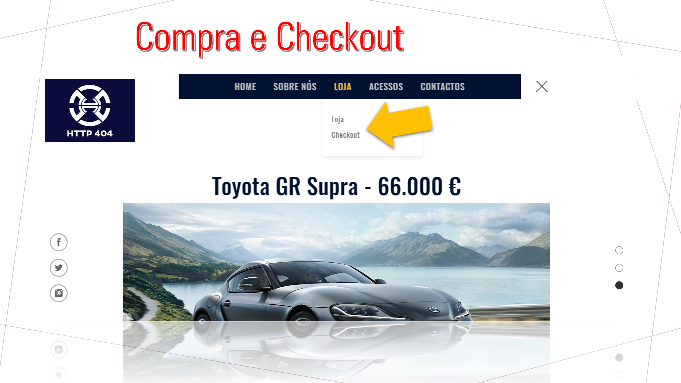

# **Portal HTTP404**

Projeto de Ambientes de Desenvolvimento Colaborativo

Sistemas e Tecnologia da Informação - Instituto Superior de Engenharia - Universidade do Algarve

Nome do Projeto: Loja virtual do Stand HTTP404

Descrição do Projeto: Loja virtual de vendas e gerenciamento da loja de veículos  

```

```
## 1. Mapa do Portal:


```

```
###  Home:
*Página Principal*

Tela com a página principal do portal:


*Destaques*

Tela com os detaques das vendas da loja:


*Reviews*

Tela com os reviews dos clientes da loja:


*Produtos*

Tela com os produtos da loja:


*Redes Sociais*

Tela com link das redes socias da loja:


###  Sobre Nós:

Tela com as informações da loja:


*Missão e Valores*

Tela com detalhes da Missão e Valores da loja:


*Membros*

Tela informações dos membros e colaboradores da loja:


*Subscrição*

Tela com espaço para subscrição do clientes no portal:


*Suporte Técnico*

Tela com informações e contatos do SUporte Técnico:


###  Loja:

Tela para finalização da compra e checkout dos produtos da loja:



###  Acesso:

Tela para acesso aos Clientes/Interno:


###  Contactos:

*Localização*

Tela com informação de morada e mapa da loja:


*Telefones/Emails*

Tela de acesso ao Fale Conosco - Serviço ao Cliente


Contactos, morada, email e telefone da loja:


*Meios de Pagamento*

Tela com informações dos meios de pagamentos:


Aproveite nosso projeto!